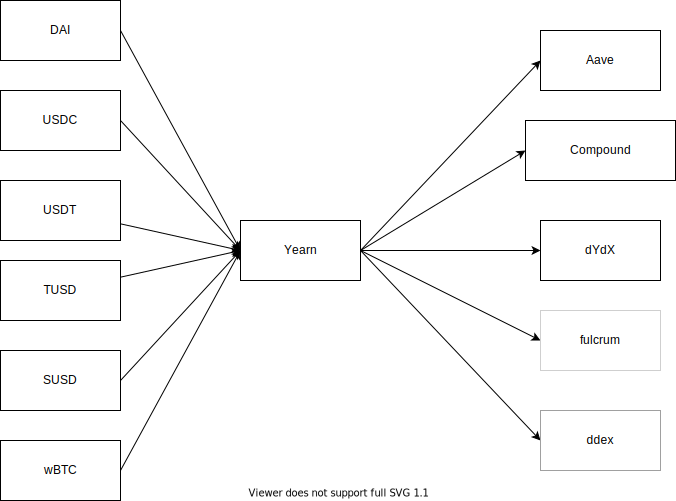
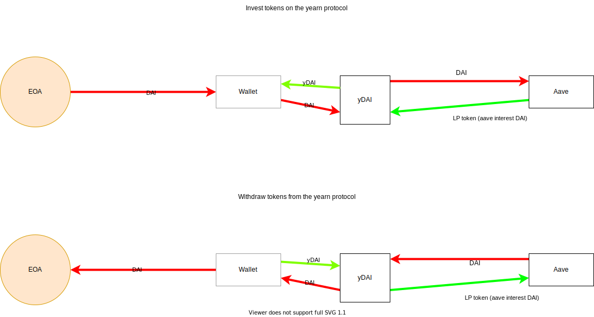
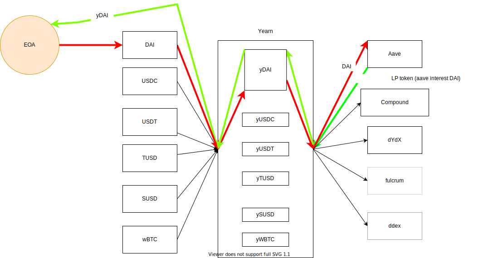

# [yearn.finance](https://yearn.finance)

## Description

Using the yearn finance, you can invest stablecoins in the protocol with highest interest rate automatically without a need of checking interest rate of all platforms individually. Technically, you send tokens to the smart contract of yearn finance, the tokens will be automatically forwarded to the protocol with highest interest rate.

Invest stablecoin into yearn protocol and yearn re-invests the same stablecoins in different yield protocols.



## Architecture of a DeFi wallet



- The <a href="https://etherscan.io/token/0x6b175474e89094c44da98b954eedeac495271d0f" target="_blank">DAI</a> is not sent directly to the <a href="https://etherscan.io/token/0x16de59092dae5ccf4a1e6439d611fd0653f0bd01" target="_blank">yDAI</a> contract, instead it is sent to wallet contract and the wallet triggers the operation.

- When you spend <a href="https://etherscan.io/token/0x6b175474e89094c44da98b954eedeac495271d0f" target="_blank">DAI</a> , you did not need to withdraw the same from yearn finance protocol and afterwards transfer the DAI. Everthing is done in single transaction. So, just ask the wallet to send [50 DAI] to the destination address. The remainder of DAI in the wallet will get reinvested in the yearn finance protocol to keep earning interest.
- It abstracts the yearn finance protocol. All that end user has to do is send token to wallet and it automatically earns interest without worry about mechanics of DeFi protocol.

## Technical assessment on <a href="yearn.finance" target="_blank">yearn.finance</a>.

- [Explain how Zap and Earn work](#Explain-how-Zap-and-Earn-work)
- [Explain y tokens](#explain-y-tokens)
- [Explain y.curve.fi, y.busd.fi](#explain-ycurvefi-ybusdfi)
- [Explain how the interest rate is calculated, how Yearn determines where to deposit user funds and how interest is calculated.](#explain-how-the-interest-rate-is-calculated-how-Yearn-determines-where-to-deposit-user-funds-and-how-interest-is-calculated) 


## Explain how Zap and Earn work

### [Zaps](https://yearn.finance/zap)

#### What is a Zap?
- Zap allows users to convert supported tokens with just one contract interaction to reduce transaction costs
- Zaps were made by DefiZap which is now [Zapper.fi](https://zapper.fi) as a type of all in one defi routing service. 

#### Why use a Zap?
- "Zaps allow you get into a DeFi position in one transaction—it’s called zapping in." - [How to use Zaps guide](https://defitutorials.substack.com/p/how-to-use-defizap)
    - Note that this is an old article and [Zapper](https://zapper.fi) was formed as a result of DeFiSnap + DeFiZap coming together to create the ultimate hub for Decentralized Finance aka #DeFi. So some of the stuff in the article above is out of date, but you can still use Zaps on Zapper.fi

#### So what can I do with Zaps on yearn?
- With as zap you can take your DAI, for example, and get yCurve with it in one transaction. Normally, to turn DAI in to yCRV, you would have to go to earn, deposit DAI and receive yDAI, then go to [Curve.fi - Yearn pool](https://www.curve.fi/iearn/deposit) and deposit your yDAI and then you would get yCRV. This is alot to do so instead you can do it in one transaction!

#### That sounds awesome, what's the downside?
- Well, it does take a lot of gas and could be costly, even more so than doing it yourself manually, but if you have a big transaction and are in a rush it is a great method to get into a DeFi position or liquidity pool fast.

### [Earn](https://yearn.finance/earn)
- Yield aggregator for lending platforms that rebalances for highest yield during contract interaction.
- Deposit DAI, USDC, USDT, TUSD, or sUSD and it will auto lend to the highest lending rate on these platforms [Compound](https://compound.finance/), [Dydx](https://dydx.exchange/), or [Aave](https://app.aave.com/home) (Ddex and Fulcrum are currently disabled)
- Info on this can be found in the [Yearn Docs](https://docs.yearn.finance/yearn.finance/yearn)
- Profit switching lender to optimize lending yields (live)

Yearn has different smart contract for different stablecoins:
-  <a href="https://etherscan.io/token/0x16de59092dae5ccf4a1e6439d611fd0653f0bd01" target="_blank">yDAI</a> contract is for <a href="https://etherscan.io/token/0x6b175474e89094c44da98b954eedeac495271d0f" target="_blank">DAI</a> stablecoin.
- <a href="https://etherscan.io/token/0xd6ad7a6750a7593e092a9b218d66c0a814a3436e" target="_blank">yUSDC</a> contract is for <a href="https://etherscan.io/token/0xa0b86991c6218b36c1d19d4a2e9eb0ce3606eb48" target="_blank">USDC</a> stablecoin
- <a href="https://etherscan.io/token/0xa1787206d5b1be0f432c4c4f96dc4d1257a1dd14" target="_blank">yUSDT</a> contract is for <a href="https://etherscan.io/token/0xdac17f958d2ee523a2206206994597c13d831ec7" target="_blank">USDT</a> stablecoin
- <a href="https://etherscan.io/token/0x73a052500105205d34daf004eab301916da8190f" target="_blank">yTUSD</a> contract is for <a href="https://etherscan.io/token/0x0000000000085d4780B73119b644AE5ecd22b376" target="_blank">TUSD</a> stablecoin
- <a href="https://etherscan.io/token/0x36324b8168f960a12a8fd01406c9c78143d41380" target="_blank">ySUSD</a> contract is for <a href="https://etherscan.io/token/0x57ab1ec28d129707052df4df418d58a2d46d5f51" target="_blank">SUSD</a> stablecoin
- <a href="https://etherscan.io/token/0x04aa51bbcb46541455ccf1b8bef2ebc5d3787ec9" target="_blank">yWBTC</a> contract is for <a href="https://etherscan.io/token/0x2260fac5e5542a773aa44fbcfedf7c193bc2c599" target="_blank">WBTC</a> stablecoin


- As shown in the above diagram, the owner will send DAI tokens to <a href="https://etherscan.io/token/0x16de59092dae5ccf4a1e6439d611fd0653f0bd01" target="_blank">yDAI</a>  contract. The contract forward that tokens to <a href="https://etherscan.io/token/0xfC1E690f61EFd961294b3e1Ce3313fBD8aa4f85d" target="_blank">Aave Interest bearing DAI (aDAI)</a> contract as it might gave higher interest rate at that point in time. This DeFi contract will give liquidity provider token (aDAI token) in return. The rebalancing in the protocol happens everytime someone invests in the yearn finance protocol.

#### What is Earn protocol?

- It lends out stablecoin for a profit.

#### What does it actually do?

- It compare the prices across different platforms as to which one is offering the highest yield. It moves the tokens into that platform. For e.g 
  - It will go into  <a href="https://app.defiscore.io/platforms/aave" target="_blank">defiscore/Aave</a> and check as to how much am I getting for DAI? Say 4%.
  - It will go into <a href="https://app.defiscore.io/platforms/ddex" target="_blank">defiscore/ddex</a> and check how much am I getting for DAI? Say 0.1%.
  - It will go into <a href="https://app.defiscore.io/platforms/compound" target="_blank">defiscore/compound</a> and check how much am I getting for DAI? Say 3.42%.
- Similarly it goes downs the list of other protocols like Nuo, bZx, Oasis, dYdX and at the end of the day which one will give you the best return and moves the money to that protocol.
- In a nutshell, the protocol will check which platform is getting best yield for particular stablecoin like DAI, USDC, USDT, TUSD, SUSD,wBTC etc and moves the entire fund(entire pool of coins) into that protocol. 
- All in all, when you deposit in Earn, your coins will go in the pooland they will get lent out for small return on your investment. Startegy here is looks for the highest APR and moves the tokens there.

### Why did [Andre](https://twitter.com/AndreCronjeTech) created Earn protocol?

- Few year ago Andre was managing other people's money. He did not like to speculate(which tokens are going to up or down). He wanted to generate a small return for his investors. For that he would look up different interest rates that were available on different DeFi protocols(Aave, dy/dx, fulcrum). He would figure out whoch one is the most profitable for that and put all his funds into that protocol. However, doing this manually was very annoying for Andre. So, that led to development of Earn protocol. 

## Explain y tokens

- When you deposit your tokens to yearn.finance, they are converted to yTokens, which are periodically rebalanced to choose the most profitable lending service(s). Curve.fi is a prominent integrator of yTokens - creating an AMM (Automated Market Maker) between yDAI, yUSDC, yUSDT, yTUSD that not only earns the lending fees but also the trading fees on Curve.fi.
- Yield earning tokens
- Interest bearing asset
- It is the liquidity provider tokens returned to the investors on investment to yearn.
- After depositing `$DAI` into <a href="yearn.finance">yearn.finance</a> you receive `$yDAI`. You can provide `$yDAI` as liquidity to <a href="curve.fi">curve.fi</a>. You can earn trade fees (0.04% per trade) on top of yield rewards. 
- <a href="curve.fi">curve.fi</a> supports $yDAI, $yUSDC, $yUSDT, $yTUSD

## Explain `$YFI`

- YFI, yearn.finance's governance token, is distributed only to users who provide liquidity with certain yTokens. With no pre-mine, pre-sale, or allocation to the team, YFI strives to be the most decentralized token. Although most of the ecosystem was built by Andre Cronje, control of YFI was transferred to a multi-signature wallet, which requires 6 out of 9 participants to agree on changes.

### Technical details
Mainnet address : [0x0bc529c00C6401aEF6D220BE8C6Ea1667F6Ad93e](https://etherscan.io/address/0x0bc529c00C6401aEF6D220BE8C6Ea1667F6Ad93e)

- Its and ERC20 token
- It has multiple minters
```js
  mapping (address => bool) public minters;
  function mint(address account, uint amount) public {
      require(minters[msg.sender], "!minter");
      _mint(account, amount);
  }
  function addMinter(address _minter) public {
      require(msg.sender == governance, "!governance");
      minters[_minter] = true;
  }
  
  function removeMinter(address _minter) public {
      require(msg.sender == governance, "!governance");
      minters[_minter] = false;
  }
```
- Functionality to change the `governance`
```js
  address public governance;
  function setGovernance(address _governance) public {
      require(msg.sender == governance, "!governance");
      governance = _governance;
  }
```
## Explain [y.curve.fi](https://y.curve.fi), [y.busd.fi](https://y.busd.fi)

### [y.curve.fi](https://y.curve.fi)

-

### [y.busd.fi](https://y.busd.fi)
 -

## Explain how the interest rate is calculated, how Yearn determines where to deposit user funds and how interest is calculated.

- There is a rebalancer that takes care about pool which earns best APR. The pool with highest APR will be recommended by <a href="https://etherscan.io/address/0xdD6d648C991f7d47454354f4Ef326b04025a48A8">IEarnAPRWithPool</a> contract.

`deposit()`
- pool - total number of DAI tokens held by yDAI contract all lending pools (compound, aave, dy/dx, fulcrum, ddex)
- 